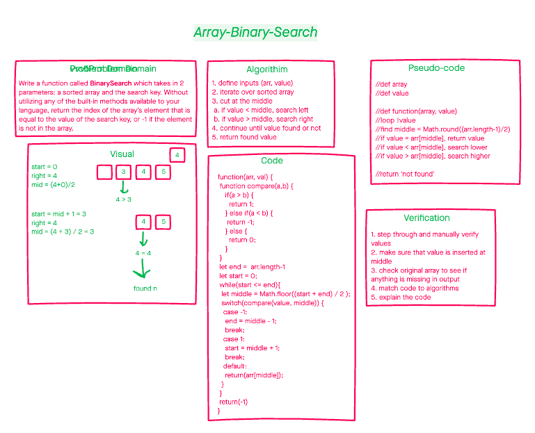

# array-binary-search

June 16, 2021

## problem domain

Write a function called BinarySearch which takes in 2 parameters: a sorted array and the search key. Without utilizing any of the built-in methods available to your language, return the index of the array’s element that is equal to the value of the search key, or -1 if the element is not in the array.

| input | output |
| --- | --- |
| [1,2], 2 | 2 |
| [1,2,3,4], 3 | 3 |
| [10,11,44,50,60], 60 | 60 |
| [1,2,3,4,5,6], 4 | 4 |

## white board

## approach and efficiency

This is a very efficient algorithm as it use logarithmic time complexity. the approach to continously divide the search pool until the value is found.