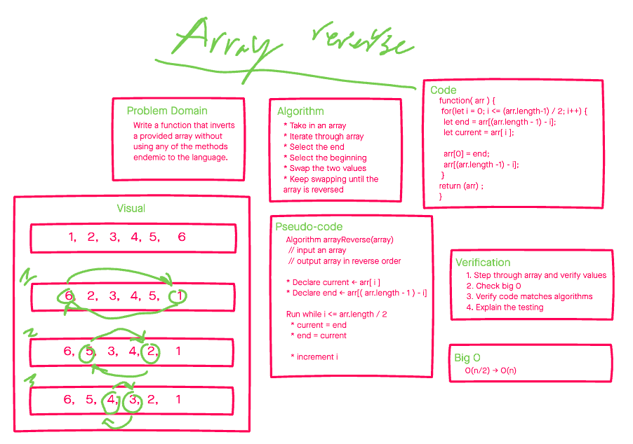

# Reverse an Array

Write out a function that takes an array. Without using methods endemic to the language return an array in reversed order.

## Whiteboard Process

## Approach & Efficiency

My approach was to swap the first and the last elements moving towards the middle. This allows us to cut the number of steps in half as the pool gets smaller.