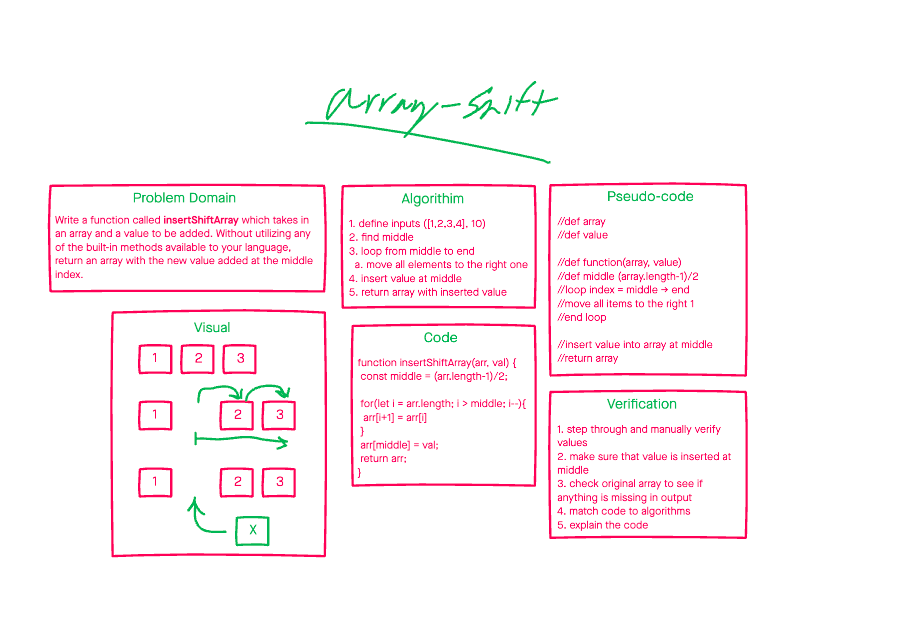

# Insert and shift an array in middle at index

Write a function called **insertShiftArray** which takes in an array and a value to be added. Without utilizing any of the built-in methods available to your language, return an array with the new value added at the middle index.


| input | output
| ---| --- |
| [1,1,3,4,5,6], X | [1,1,3,X,4,5,6]
| [1,2,3,6,5], X   | [1,2,3,X,6,5]
| [1,2,3,5], X     | [1,2,X,3,5]
| [1,2,5], X       | [1,2,X,5]

## Whiteboard Process



## Approach & Efficiency

My approach was to open a gap at the middle of the array to prevent modifying of data. Another approach would be to create two seperate arrays and combine them at return:

```JS
const val = 6
const arr = [1,2,3,4];

function insertShiftArray(arr, val) {
  let middle = Math.round((arr.length - 1)/2);
  let res = [];

  //res = []
  for(let i = 0; i < middle; i++) {
    res[i] = arr[i];
  }
  //res = [1,2,val]
  res[middle] = val;

  for(let j = middle; j < arr.length; j++){
    res[j+1] = arr[j]
  }

  return res;
}

insertShiftArray(arr,val);
```