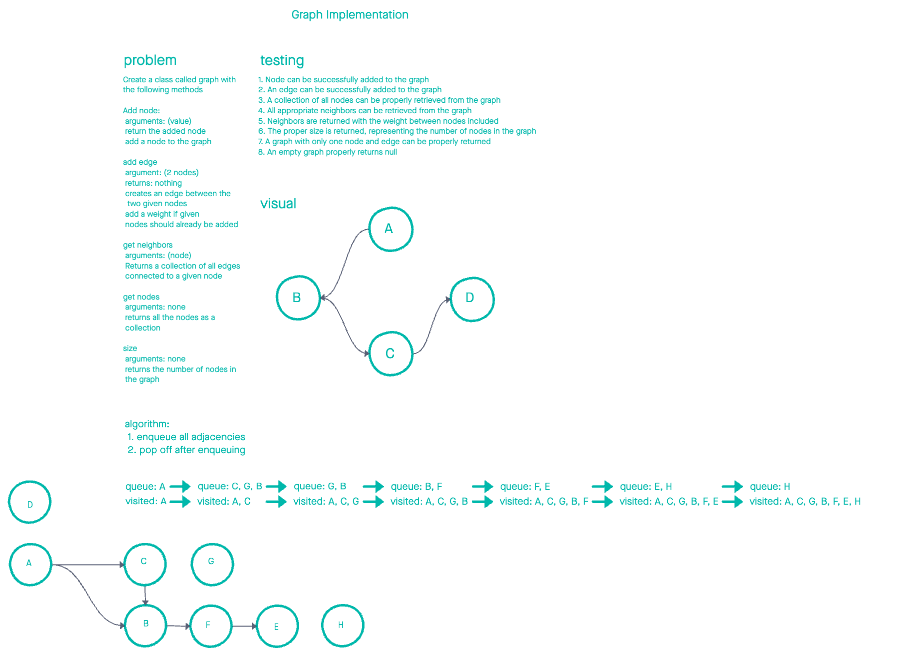

# Graph Implementation

## 🚀 Getting Started

1. Install deps with `npm i` or `yarn i`
1. Run tests `npm test`

## 🦅 Overview

Create a class called graph with the following methods

1. Add node:
    * arguments: (value)
    * return the added node
    * add a node to the graph

1. add edge
    * argument: (2 nodes)
    * returns: nothing
    * creates an edge between the two given nodes
    * add a weight if given
    * nodes should already be added

1. get neighbors
   * arguments: (node)
   * Returns a collection of all edges
   * connected to a given node

1. get nodes
    * arguments: none
    * returns all the nodes as a
    * collection

1. size
    * arguments: none
    * returns the number of nodes in
    * the graph

## 📈 White board

## 🧪 Testing

- [x] Node can be successfully added to the graph
- [x] An edge can be successfully added to the graph
- [x] A collection of all nodes can be properly retrieved from the graph
- [x] All appropriate neighbors can be retrieved from the graph
- [x] Neighbors are returned with the weight between nodes included
- [ ] The proper size is returned, representing the number of nodes in the graph
- [x] A graph with only one node and edge can be properly returned
- [ ] An empty graph properly returns null

