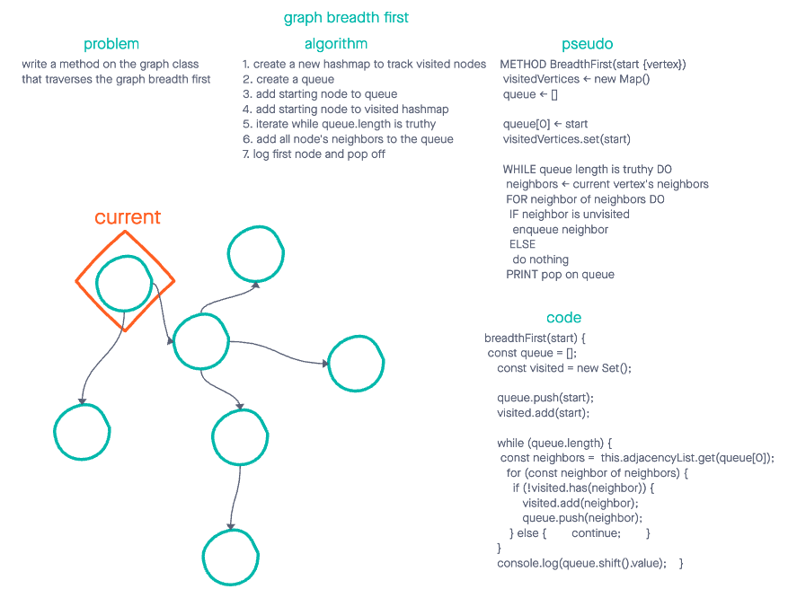

# Breadth First

## 🦅 Overview

Write a method on the Graph class that traverses the graph breadth first

## 📈 White board

## Approach and efficiency

Breadth first traversal has a space and time complexity of O(n)