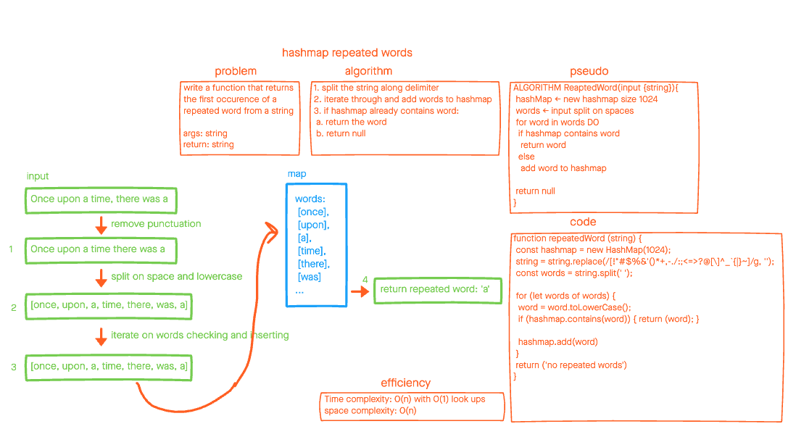

# Hashmap Repeated Word

July 26, 2021

## 🚀 Quick Start

1. Install dependencies with `npm i` or `yarn i`
2. Run tests with `npm test`

## 🌎 Overview

Write a function that finds the first occurrence of a repeated word and returns the word.

## ⚙️ Efficiency and Approach

`Time complexity: O(n)`

`Space complexity: O(n)`

This algorithm has a space complexity of `n` because we start by creating an array of all words in the string. It also has a time complexity of `n`, because at worst it will make `n` look-ups to the hashmap.
