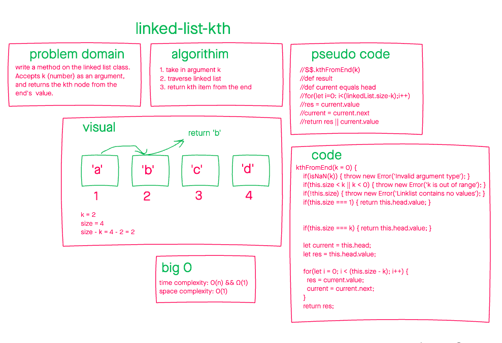

# kth from the end

June 22, 2021

## problem domain

write a method on the linked list class called `kthFromEnd`. Given value `k` as a parameter, return the kth from the end node's `value`.

## white board

## unit tests

1. Where k is greater than the length of the linked list
2. Where k and the length of the list are the same
3. Where k is not a positive integer
4. Where the linked list is of a size 1
5. “Happy Path” where k is not at the end, but somewhere in the middle of the linked list

## efficiency and approach

- time complexity: `O(n)` && `Ω(1)`

- space complexity: `O(1)`
