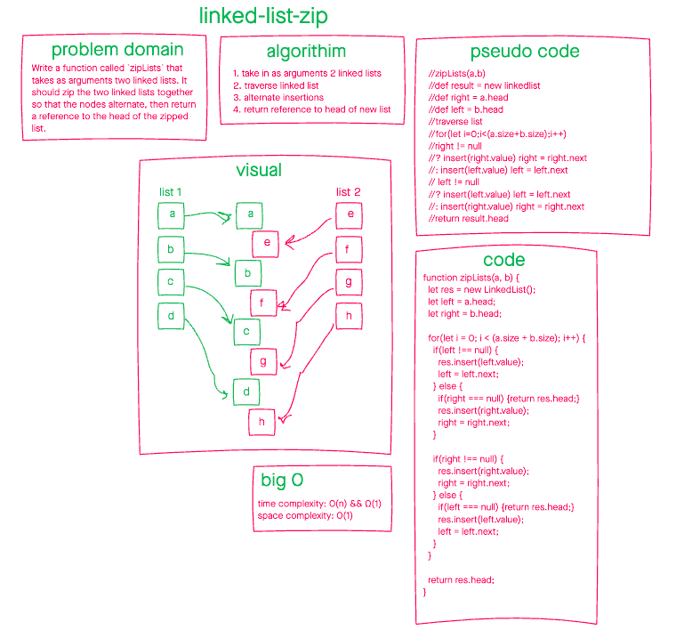

# Linked-list-zip

June 23, 2021

## Problem Domain

Write a function called `zipLists` that takes as arguments two linked lists. It should zip the two linked lists together so that the nodes alternate, then return a reference to the head of the zipped list.

## Whiteboarding

## Approach and Efficiency

The algorithim exits in one step if there's only one node to zip, and solves in O(n * 2) or O(n). It will exit immediately if either argument is undefined.

- time complexity: O(n) && Ω(1)
- space complexity: O(1)
