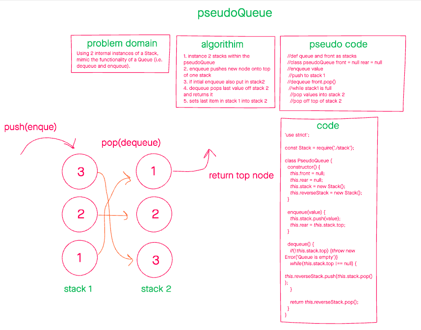

# PseudoQueue

June 28, 2021

## Challenge Summary

Using 2 internal instances of the stack class mimic the enqueue and dequeue methods of a queue. Create a class called pseudoQueue according to the previous criteria.

## Whiteboard

## Approach

A queue is *simply* a reversed stack; my approach was to leverage this idea. The front is the last thing in the stack, but if we successively pop and push values from one stack to the other, the order reverses.

[1,2,3,4] and []
[1,2,3] pop [4]
[1,2] pop [4,3]
[1] pop [4,3,2]
[] pop [4,3,2,1]

## Code

To start: `node pseudoQueue.js`
