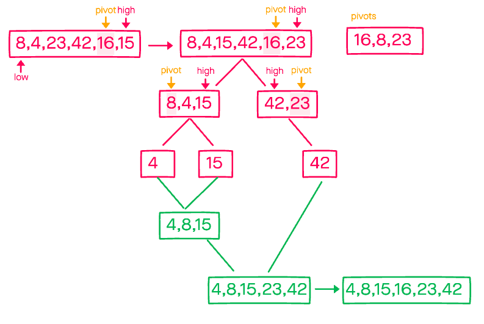

# Merge Sort

`July 20, 2021`

## 🚀 Getting Started

1. Install dependencies with `npm i` or `yarn i`
2. Run tests with `npm test`

## 🌎 Overview

Quick sort is an algorithm that can be slightly faster than merge sort, but on average is just as fast `O(n ㏒ n)`. Similar to merge sort, we take a divide and conquer approach. We start be picking a pivot and sorting values to the left or right. If the value is less than the pivot, then sort left. Sort the value on the right if it's larger than the pivot. The algorithm is then recursively called on the two halves until they are a single element. The elements are then merged back into a sorted array based on the pivots.

## 🛠 Pseudo Code

```JS
ALGORITHM QuickSort(arr, left, right)
    if left < right
        // Partition the array by setting the position of the pivot value
        DEFINE position <-- Partition(arr, left, right)
        // Sort the left
        QuickSort(arr, left, position - 1)
        // Sort the right
        QuickSort(arr, position + 1, right)
```

We first define the pivot value. provided its within the list, It can be anything. This helper function `partition` will do the job of partitioning our list into sub-list left and right. It will also keep track of the largest index below the pivot, and return that.

```JS
ALGORITHM Partition(arr, left, right)
    // set a pivot value as a point of reference
    DEFINE pivot <-- arr[right]
    // create a variable to track the largest index of numbers lower than the defined pivot
    DEFINE low <-- left - 1
    for i <- left to right do
        if arr[i] <= pivot
            low++
            Swap(arr, i, low)

     // place the value of the pivot location in the middle.
     // all numbers smaller than the pivot are on the left, larger on the right.
     Swap(arr, right, low + 1)
    // return the pivot index point
     return low + 1
```

Our last helper will be responsible for swapping values around the pivot.

```JS
ALGORITHM Swap(arr, i, low)
    DEFINE temp;
    temp <-- arr[i]
    arr[i] <-- arr[low]
    arr[low] <-- temp
```

## 🚶 Walk Through

sample case: `[8, 4, 23, 42, 16, 15]`

To start we pick a pivot point; we'll just use the last element in the list (15). We also have to define a left value, which will just be the first element (8).

Elements are compared against the pivot's value, and are moved left and right according to their value; left if they are less than the pivot, and right if they are greater than the pivot's value.

This process of partitioning and swapping happens recursively until the elements are sorted.



## ⚙️ Efficiency

Time-complexity: O(n ㏒ n) or O(n²)

Space-complexity: O(1)
