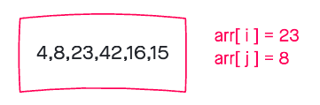

# Insertion Sort

<!-- replace with shield later -->
July 19, 2021

Insertion sort is one of the most basic sorting algorithms your can write. It works by looping over a list of values and *inserting* the value behind the current value until the list is sorted. For each value in the list, it compares that value against the previous value; if the current value is less than the previous value, it gets inserted behind it. The loop continues until that value finds its in the list.


## Pseudo code

<!-- What is int[]?  -->

```JS
  InsertionSort(int[] arr)
    FOR i = 1 to arr.length

      int j <-- i - 1
      int temp <-- arr[i]

      WHILE j >= 0 AND temp < arr[j]
        arr[j + 1] <-- arr[j]
        j <-- j - 1

      arr[j + 1] <-- temp
```

## Whiteboard

Sample: `[8,4,23,42,16,15]`

Expected: `[4,8,15,16,23,42]`

### `step 1`


On the first step we make a single comparison between 4 and 8. Because 4 is less than 8, which is the previous node in the list, we switch them.

### `step 2`



23 is greater than 8, so we keep moving without swapping.

### `step 3`


42 is greater than the 23, so they're in order (do nothing).

### `step 4`


16 is less than 42, so they swap. 16 is then smaller than the next value in the lest (23), so they swap. Finally, 16 is greater than 8, so it's in the right place.


### `step 5`


15 is less than 42, so they swap positions; 15 is less than 23... swap; 15 is less than 16... swap. 15 is *not* less than 8, so the loop stops.


The list is now in order from smallest to largest!

## Efficiency

This algorithm has a worst case efficiency of `O(n²)`, because it has to check every value against all previous values.

It has a constant space efficiency of `O(1)`.