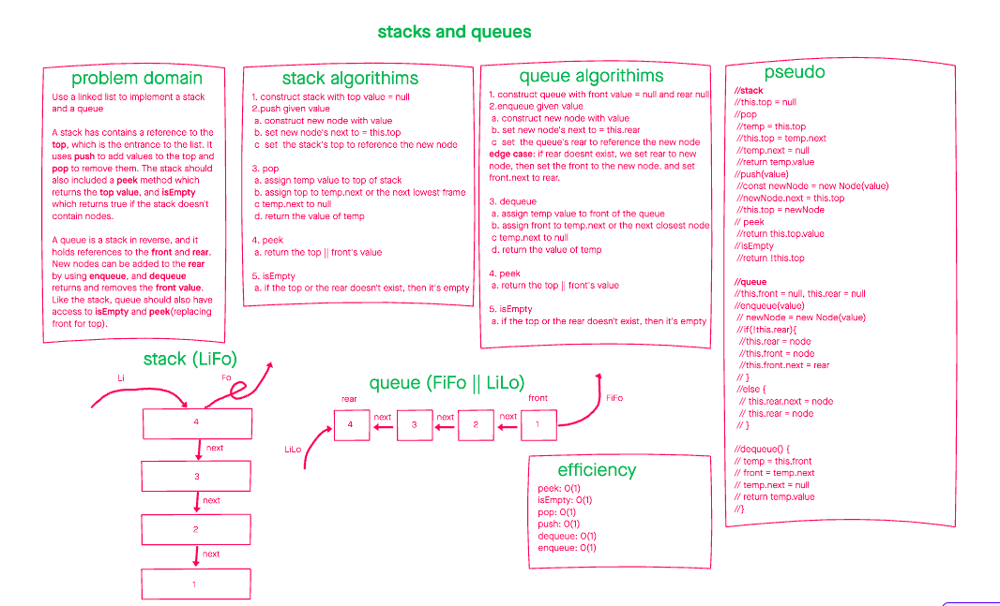

# Stacks and Queue

June 25, 2021

Stacks and queues are abstract data types that operate on LiFo and FiFo respectively.

## Problem Domain

### Use a linked list to implement a stack and a queue

A stack contains a reference to the top, which is the entrance to the list. It uses push to add values to the top and pop to remove them. The stack should also included a peek method which returns the top value, and isEmpty which returns true if the stack doesn't contain nodes.

A queue is a stack in reverse, and it holds references to the front and rear. New nodes can be added to the rear by using enqueue, and dequeue returns and removes the front value. Like the stack, queue should also have access to isEmpty and peek(replacing front for top).

## Whiteboarding

## Unit tests

1. Can successfully push onto a stack
1. Can successfully push multiple values onto a stack
1. Can successfully pop off the stack
1. Can successfully empty a stack after multiple pops
1. Can successfully peek the next item on the stack
1. Can successfully instantiate an empty stack
1. Calling pop or peek on empty stack raises exception
1. Can successfully enqueue into a queue
1. Can successfully enqueue multiple values into a queue
1. Can successfully dequeue out of a queue the expected value
1. Can successfully peek into a queue, seeing the expected value
1. Can successfully empty a queue after multiple dequeues
1. Can successfully instantiate an empty queue
1. Calling dequeue or peek on empty queue raises exception

## Approach and efficiency

The approach here is that by supplying references to the front/end/top we can complete operations in O(1).

## API

### Stack

#### Push()

adds a new node to the top of the stack

#### Pop()

removes the top node in the stack, and returns its value

#### Peek()

returns the top node's value with out modifying anything

#### isEmpty()

returns true if the stack doesn't contain nodes

### Queue

#### Enqueue(value)

adds a new node with value to the end of the queue

#### Dequeue()

removes the node at the front, and returns its value

####  Peek()

returns the front node's value with out modifying anything

#### isEmpty()

returns true if the queue doesn't contain nodes
