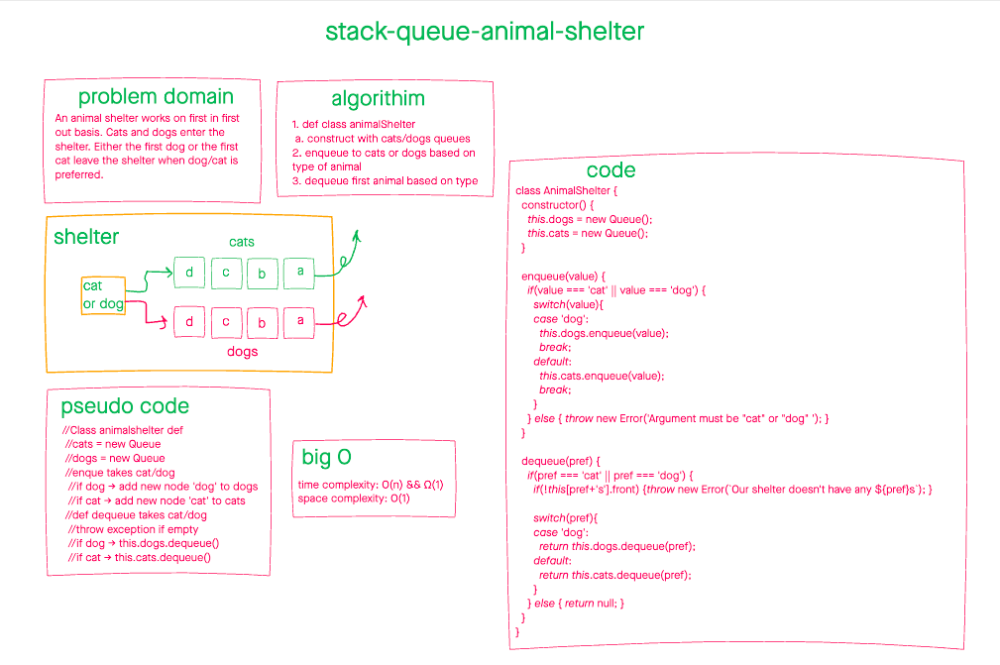

# Stacks and Queue Animal Shelter

June 29, 2021

Stacks and queues are abstract data types that operate on LiFo and FiFo respectively.

## Problem Domain

An animal shelter operates on the principle of first in first out. Create an AnimalShelter class that accepts only cats and dogs, and utilizes basic queue methods (i.e. enqueue and dequeue).

## Whiteboarding

## Approach and efficiency

The approach here is that by supplying references to the front/end/top we can complete operations in O(1).

## API

### AnimalShelter

#### Enqueue(value)

Accepts 'cat' or 'dog', and adds it to the rear of cats or dogs queues.

#### Dequeue(pref)

Accepts 'cat' or 'dog' and dequeue appropriate queue.
