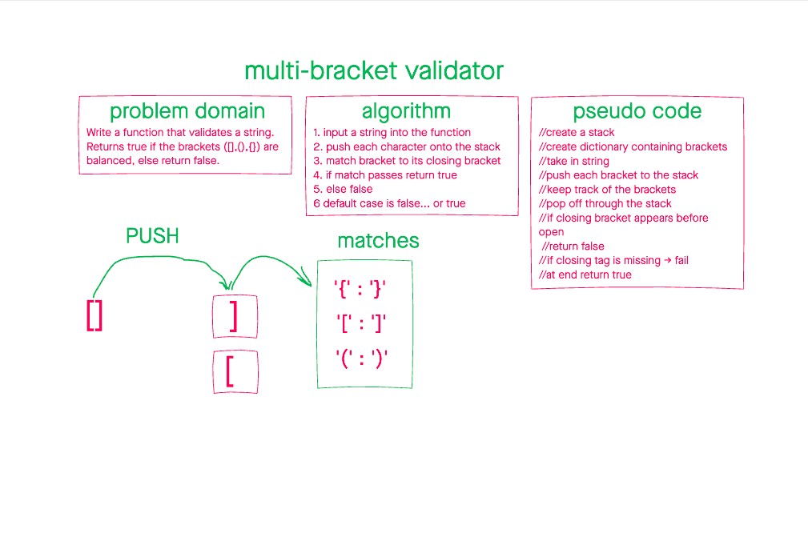

# Multi-bracket Validation

June 30, 2021

## Features

- Write a function called validateBrackets
- Arguments: (string)
- Return: boolean
  - Representing if the brackets in the string are balanced or not

Three types of brackets:

1. round: `()`
1. square: `[]`
1. curly: `{}`

## Examples

| Input | Output
| --- | ---
| `{}` | `true`
|`{}` | `true`
| `()[]{some chars}`| `true`|
| `[)}` | `false` |
| `[`| `false`|
| `[])`| `false` |

## Whiteboard

## efficiency and approach

A stack is a useful datastructure that allows us to keep things in order. More specifically, a first in last out order. With this knowledge, we can loop through a given string and push all the opening tags onto the stack. We then check if they match their corresponding closer down the line. If they don't return false.
