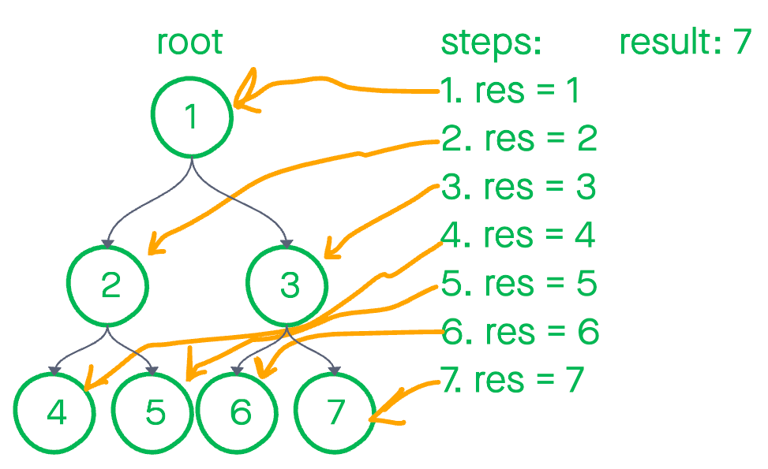

# Breadth First

Revised: July 8th, 2021

## Getting Started

```BASH
npm i
npm test
```

Today, we'll add a method to our binary tree class that allows use to run breadth first searches. What does that mean? It means we check the left and right before descending to the next level.

A tree is – more specifically a [binary tree](https://medium.com/techie-delight/binary-tree-interview-questions-and-practice-problems-439df7e5ea1f) – a data structure with a root, branches, edges, and leaves. The root is a node with two children, hence the name binary. Left and right are your only two choices to follow. Each node has their own branches, called edges, which connect to other nodes. At the end of the branches are leaves, a special node without any connections.


Using the above tree as an example, a breadth first traversal would log values in this order: `[1,2,3,4,5,8,9,10,11,6,7,13,14]`

## Algorithm

1. start at the root
1. define queue
1. enqueue root node
1. while queue isn't empty
    1. enqueue left and right
    1. log the nodes value
    1. remove node from queue

## Pseudocode

```JS
// procedure breadthFirst takes no arguments
  // here we'll define the queue
  // a helper datastructure that will allow us to store nodes
  // var queue <- []

  // enqueue the root node 
  // iterate through the binary tree 
  // while the queue's length is > 0
    // enqueue first to prevent the loop from exiting early
    // enqueue left and right nodes
    // dequeue the first node and log it's value
```

## Code

```JS
breadthFirst() {
  let queue = [];
  let node = this.root;

  // enqueue root: [root]
  queue.push(this.root);

  while(queue.length > 0){
    // enqueue left and right [root, left, right]
    // 2. [left, right, left.left, left.right]
    // 3. [right, left.left, left.right, right.left, right.right ]
    if(node.left) { queue.push(node.left); }
    if(node.right) { queue.push(node.right); }

    // shift out front and assign it to node: [left, right]
    // 2. [right, left.left, left.right]
    // 3. [left.left, left.right, right.left, right.right]
    node = queue.shift();
    console.log(node.value);
  }
}
```

## Whiteboard



## Approach and Efficiency

The best case efficiency is `O(n)` as we'll always need to check every single value. And `O(1)` in extra space as we have to create the queue.
