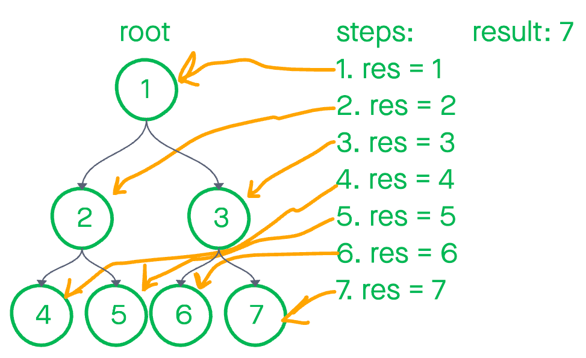

# Trees

July 7nd, 2021

In today's challenge we'll be writing a function called fizzBuzzTree(). It will take a k-ary tree and create a new tree from its nodes. If the node's value is divisible by 3 replace with 'Fizz'. If it's divisible by 5 add 'Buzz'. If the value is divisible by 3 and 5, insert 'FizzBuzz'. If none of these conditions are satisfied, convert the number into a string and add it to the new tree.

The output tree should have the same structure as the input tree.

## Background info

The primary difference between a binary tree and a k-ary tree is that the latter can have any number of branches. Where the binary tree had two, a k-ary tree can have many.


## Algorithm

1. Define a variable to hold our result
1. Traverse the entire tree
1. If a node's value is greater than our result variable, result becomes that node's value
1. Otherwise leave the variable alone
1. Continue until all values have been checked
1. Return our result variable

## Pseudocode

```JS
  // this algorithm will find the greatest value contained in the tree and return it
  // procedure findMax()
    // declare a variable to hold the result from our algorithm
    // declared as 0, so we know that's always a number
    // res <- 0

    // next we'll create a workhorse function that will allow us to
    // recursively traverse the nodes in our tree
    // procedure walk(node)
      // if res < node's value
        // res = node.value

      // else leave res unchanged

      // if node.left is truthy
        // walk(node.left)
      
      // if node.right is truthy
        // walk(node.right)
    
    // start recursion at the root of our tree
    // walk(this.root)

    // return res
```

## Code

```JS
findMax() {
  // guard clauses prevents non numbers
  if( isNaN(this.root.value) ){ throw new Error('Tree contains non numbers'); }

  let res = 0;
  const walk = (node) => {
    if( isNaN(node.value) ){ throw new Error('Tree contains non numbers'); }

    res < node.value ? res = node.value : res;
    if(node.left){ walk(node.left); }
    if(node.right){ walk(node.right); }
  };
  walk(this.root);
  return res;
}
```

## Whiteboard



## Approach and Efficiency

The best case efficiency is `O(n)` as we'll always need to check every single value. And `O(1)` in extra space.
